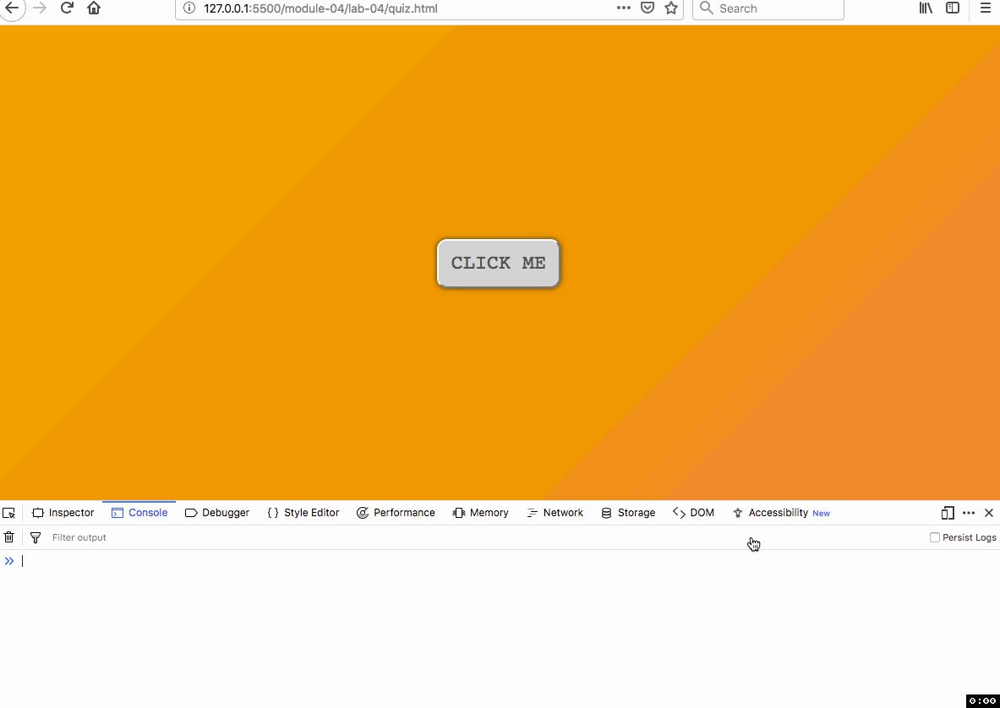

# Lab 04: Using JavaScript Functions

<!-- TOC -->

- [Lab 04: Using JavaScript Functions](#lab-04-using-javascript-functions)
    - [Part I. Understanding the lesson (4 pts)](#part-i-understanding-the-lesson-4-pts)
    - [Part II. Using functions in our map script (6 pts)](#part-ii-using-functions-in-our-map-script-6-pts)
    - [Challenge: Add custom icons to your map](#challenge-add-custom-icons-to-your-map)

<!-- /TOC -->

## Part I. Understanding the lesson (4 pts)

Create a new file named _quiz-04.md_ within your _lab-04/_ directory.

Answer the following questions and save them within the quiz-04.md file. Commit the file to your repository with a good commit message. 

Hint: write or copy/paste the code within your lesson `<script>
</script>` tags to look for errors, test, and puzzle out why the output is wrong. Or us a web service such as [JS Bin](https://jsbin.com) or [CodePen](https://codepen.io).

1. Identify the function arguments versus parameters in the following script and explain why the result is `"7"`.

```javascript
function testHigher(a, b) {
    if (a > b) {
    var higher = a;
    } else {
    var higher = b;
    }
    return higher;
};

var result = testHigher(7, "7");
console.log(result);
```

2. The following script throws an error (a "ReferenceError"). Explain why this error is thrown and provide a solution for printing out the capitalized name within the `console.log()`.

```javascript
var geographer = 'ptolemy';
function shoutName(geoName) {
    var capitalizedName = geoName.toUpperCase();
};

shoutName(geographer);
console.log(capitalizedName);
```

3. Write a function that accepts a number value as the parameter, squares that number within the function body, and returns the squared value to where the function was called (the "caller"). Assign the return value to a variable and log it to the Console.

4. Modify the JavaScript function in [quiz.html](quiz.html) to make the button change color when it's clicked. The critical changes will be inside the `if` code block. Use the `console.log()` function to test and monitor changes.

    
Figure 01: Example of page function in corrected question four

## Part II. Using functions in our map script (6 pts)

To begin, first open the _lab-04/index.html_ file within your code editor. Inspect the contents of this file, and then open the file in your web browser using the live-server/Live Preview (and, as usual, open your web developer toolbar/Console as well).

You'll notice that an HTML UI button element has been added to the page, and has an id attribute of `map-cities` and display content of "Map Cities" (`<button id='map-cities'>Map Cities</button>`).

The JavaScript contains some code that will listen for a user click event on this button. When the user clicks, the contents of the addEventListener's function (known as a "callback function") are executed. Specifically, a [JavaScript prompt function](https://developer.mozilla.org/en-US/docs/Web/API/Window/prompt) prompts the user to enter some text, and then assigns the string that's entered to the variable `units`. The code then logs that value of `units` to the console. You should test this within your browser's Console.

```javascript
button.addEventListener("click", function() {

    var units = prompt('Enter the units for calculating density', 'Enter "miles" or "km"');

    console.log(units);

});// addEventListener callback function ends here
```

Test this code by typing strings into the prompt and looking for them in the browser console.

The goal of this task is to finish writing a script that:

1. after prompting the user to enter either 'miles' or 'km', stores this result in a variable
2. calls a function to make the map and sends this variable as an argument
3. uses a looping structure to populate the map with markers while building a popup that displays the name of each city and its population density

We'll be encapsulating our code within **2 functions** we'll write to achieve this. Follow these directions to continue, but first study the example code supplied within the [_lab-04/example.html_](lab-04/example.html).

1. Where indicated at the top of your script (below the code provided that creates the map and adds the tiles to the map), build 4 array structures to hold the names of 3 different cities of your choosing, their coordinates (lat/lng), their current population, and the area of each city. These will be similar to the arrays used in Lab 04; the cityCoords array will be a nested array. These arrays contain your data used for the map.

2. Within the `addEventListener()` callback function, replace the `console.log()` statement with a call to a function named `mapCities()` and pass the `units` variable as an argument. We wish to wait until the user has entered either 'miles' or 'km' before executing the code within the `mapCities()` function.

3. Immediately write a new function named `mapCities()` where the comments indicate. This function will need to accept the `units` variable as a parameter. Within this function's body, write code that loops through the `cities` array. Within this loop, you can access each of the city's population and area values (i.e., using `cities[i]` syntax, see Lab 04). Within the loop, call a second function named `calcPopDensity()` and pass the population, the area, and the units (which will be either 'km' or 'miles') as arguments. The return value from this function will be assigned to a variable named `density` (similar to how the `prompt()` function assigns the return value to the variable `units` above).

4. Now write the new function named `calcPopDensity()` where indicated (outside of the `mapCities` function's body!). This function needs to accept 3 values as parameters: a single city's population, its area, and the variable `units` designated within the `mapCities` function (i.e., 'miles' or 'units'). Write code within the function's body that accomplishes:
        
        a. First determine whether the units are in miles or kilometers using conditional logic, and then
        b. Calculate the population density using the population and area values before returning the result to the caller (i.e., this value will be assigned to the `density` variable within the `mapCities` function). Your code within these conditional (if/else) statement bodies will need to mathematically convert the miles to kilometers if the value of `units` is changed to be 'km'.
        c. Return the calculated density value

5. Once the `calcPopDensity()` is complete, save and test your code to ensure there are no errors. You may wish to write a `console.log()` statement beneath the line in the `mapCities()` function logging the returned value of the density to ensure it is valid.

6. Once you have the density value available to you within the `mapCities()` function loop, you can then build up the markers and popups in a similar fashion as in Lab 04\. There will be one variable named `popup` which is assigned a concatenation of string values. These need to include the name of the city and the density of the city. The coordinates will be used to place each marker in its correct position.

Be sure that your code is clean and uniformly indented. For example, use your code editor's beautify function! Also be sure to comment your code and commit to Git periodically with meaningful commit messages.

**Challenge:** Note how if the user enters information incorrectly (a value of something other than 'miles' or 'km' for the unit), the script essentially breaks and the page must be reloaded. How would you go about catching these errors and again prompt the user to enter the correct information? Hint: consider using a looping mechanism and read about the [do ... while statements](https://developer.mozilla.org/en-US/docs/Web/JavaScript/Reference/Statements/do...while). This is an example in the supplemental video for this week.

## Challenge: Add custom icons to your map

Revisit your hometown-map repo or use your current list of cities and add custom icons. We'll make a custom function and Leaflet's `L.icon()` object. While we'll address JavaScripts objects in the next module, this is a gentle introduction that can add a little pizazz to your map!

First we need to classify our locations by type (the classification is up to you!) and then assign a URL to the icon you wish to show on the map. We'll use Scaled Vector Graphics (SVG) icons in this example. SVG files are written in plain text like HTML and can be easily edited. We will explore this in more detail in a future lab.

**Step 1**: Download MapBox's [Maki icons](https://www.mapbox.com/maki-icons/) and extract them into your repo. Your icons should now be in a folder called "svgs". Alternatively, you can create your own icons in a graphics editor. It's up to you!

**Step 2**: Add two arrays that classify your locations and give appropriate icons for the locations. This second array supplies the URL for the icon, which is the directory path to the icon SVG relative to the _index.html_. Make sure the position of your type and icon correspond to the correct location!

```javascript
// Group your locations into categories for symbology
const typeLocation = ["Type 1", "Type 2", "Type 3"];

// Give URL for custom icon
const typeIconURL = ["svgs/type-1.svg", "svgs/type-2.svg", "svgs/type-3.svg"];
```

**Step 3**: Create a function that checks for the type of location and then builds the icon object and returns it the `for` loop you created to populate your map with locations.

```javascript
// Iterate through array using indexes to access values
for (let i = 0; i < nameLocation.length; i++) {

// Build the location popup
let locationPopup = `<h2>${nameLocation[i]}</h2> ${detailsLocation[i]}`;

// Build Leaflet icon by calling a function to determine type of location
let iconLocation = createIcon(typeLocation[i]); // Function call

L.marker(coordinatesLocation[i], {
            icon: iconLocation // Insert returned function value
        })
        .addTo(map)
        .bindPopup(locationPopup);
};

// Function to determine type of location and return appropriate Leaflet icon object

function createIcon(typeOfLocation) {
  let iconURL = "", // declare the iconURL
      iconSize = 30; // create default size

  if (typeOfLocation == "Type 1") {
      iconURL = typeIconURL[0];
  } else (typeFacility == "Type 2") {
      iconURL = typeIconURL[1];
      iconSize = 40;
  };

  // Create a Leaflet icon object
  let result = L.icon({
      iconUrl: iconURL,
      iconSize: iconSize,
      popupAnchor: [0, -15] // Center of your icon is [0,0]
  });

  // Function returns a properly formatted Leaf icon object to place on your map
  return result;

};
```

Your map should now have custom icons for your locations!

**Take it to the max!** Add three new locations that only appear after a user clicks on a button. Think of this button as a portal to a secret geography of your city. It may have a theme like old cafes, dive bars, or places where you played as a kid.

Like the previous lab, you will need to create a new set of arrays that contain your location data and use a `for` loop to place the locations on your map. Consult the supplemental video for an example.

**Finally!** Push your final solutions with the remote repository and provide a link within Canvas by the due date.
